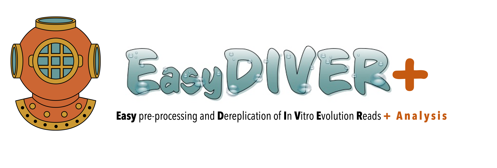

# EasyDiver+
This is the README document for the EasyDiver+ pipeline for pre-processing and analyzing HTS reads from _in vitro_ selection experiments. EasyDIVER can be used to process and analyze nucleotides or amino acids sequencing data corresponding to consecutive rounds of in vitro selection and amplification.

Consult the EasyDiver+ [documentation](https://EasyDiverPlus.readthedocs.io/) for detailed information on Installation, Usage and Examples. 

Consult the original EasyDIVER [documentation and manual](https://github.com/ichen-lab-ucsb/EasyDIVER) for details on the pre-processing part of the pipeline.   

# Test dataset

A test dataset is provided in a [Google Drive directory](https://drive.google.com/drive/folders/102sCv5uJUiUcnsgVskJigmh8lxbl3KCD?usp=sharing). The test data corresponds to two samples obtained from a real experiment of in vitro evolution of mRNA displayed peptides. Instructions on how to run the pipeline for the test dataset can be found in the [documentation](https://EasyDiverPlus.readthedocs.io/).
     
# Reporting bugs

Report any bugs to Celia Blanco (celia.blanco@bmsis.org). 

When reporting bugs, please include the full output printed in the terminal when running the pipeline. 

# Citation

TBD

