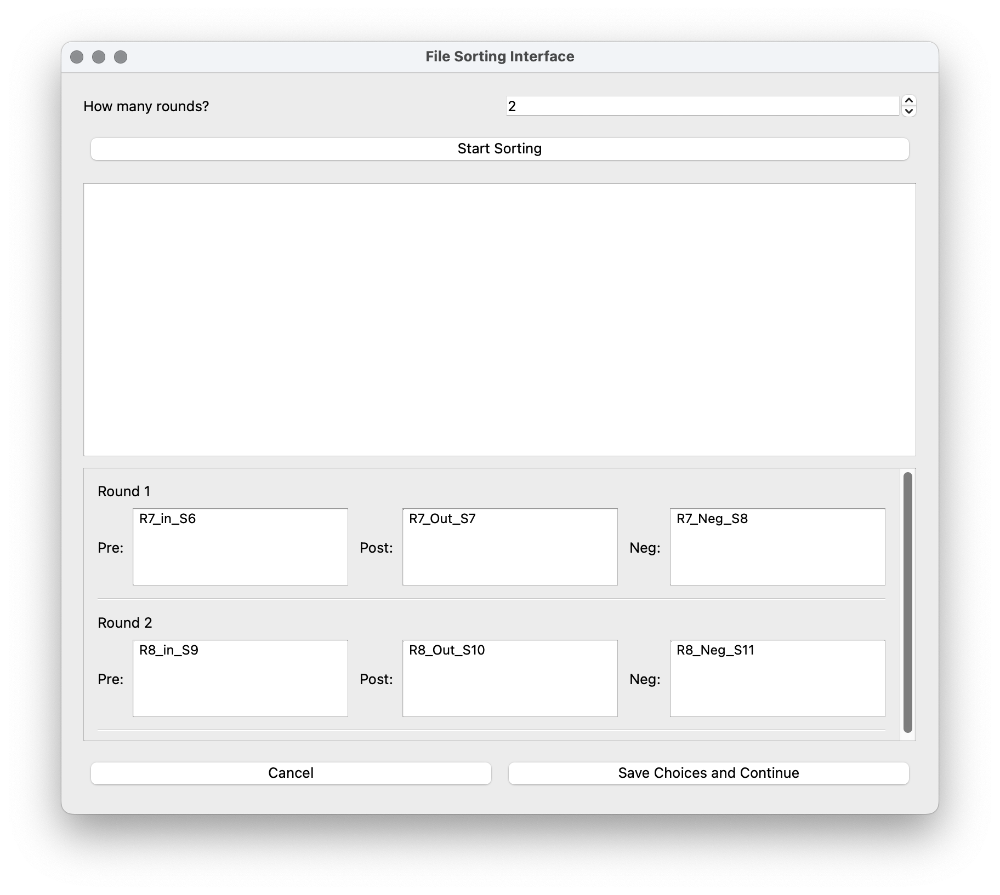
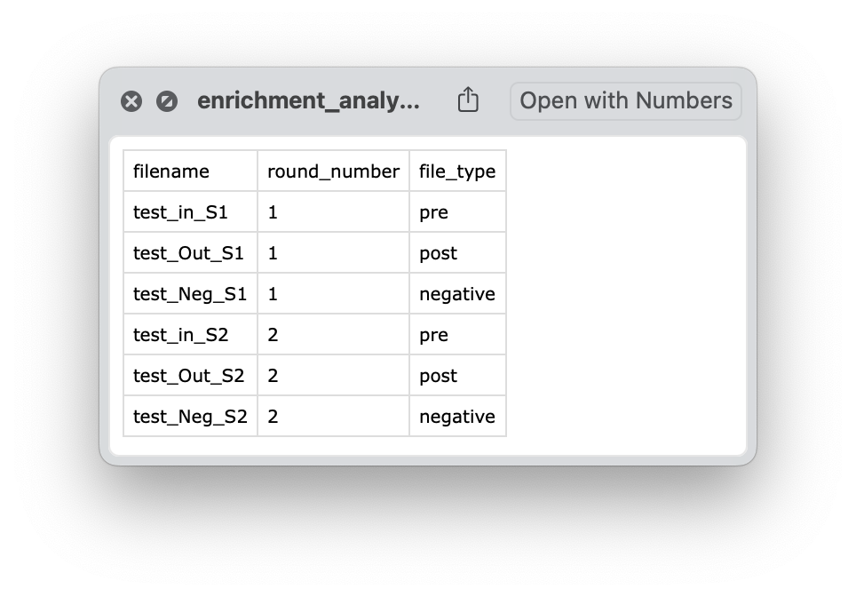
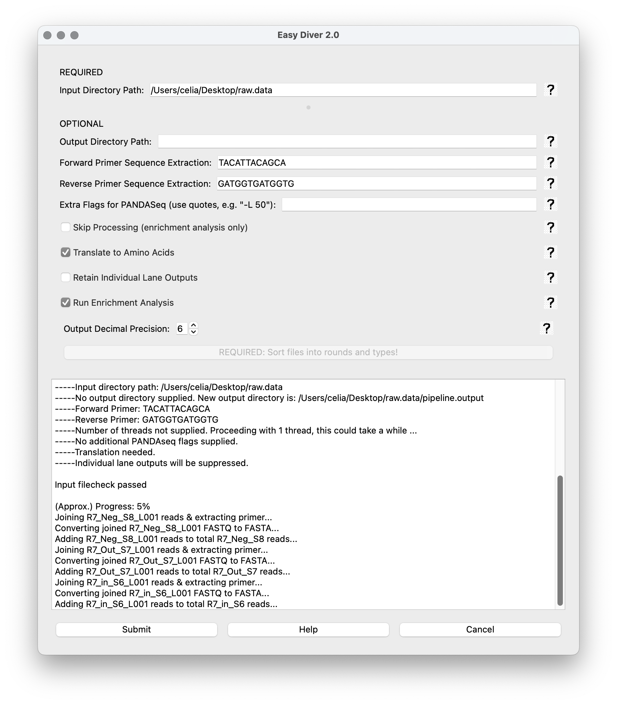
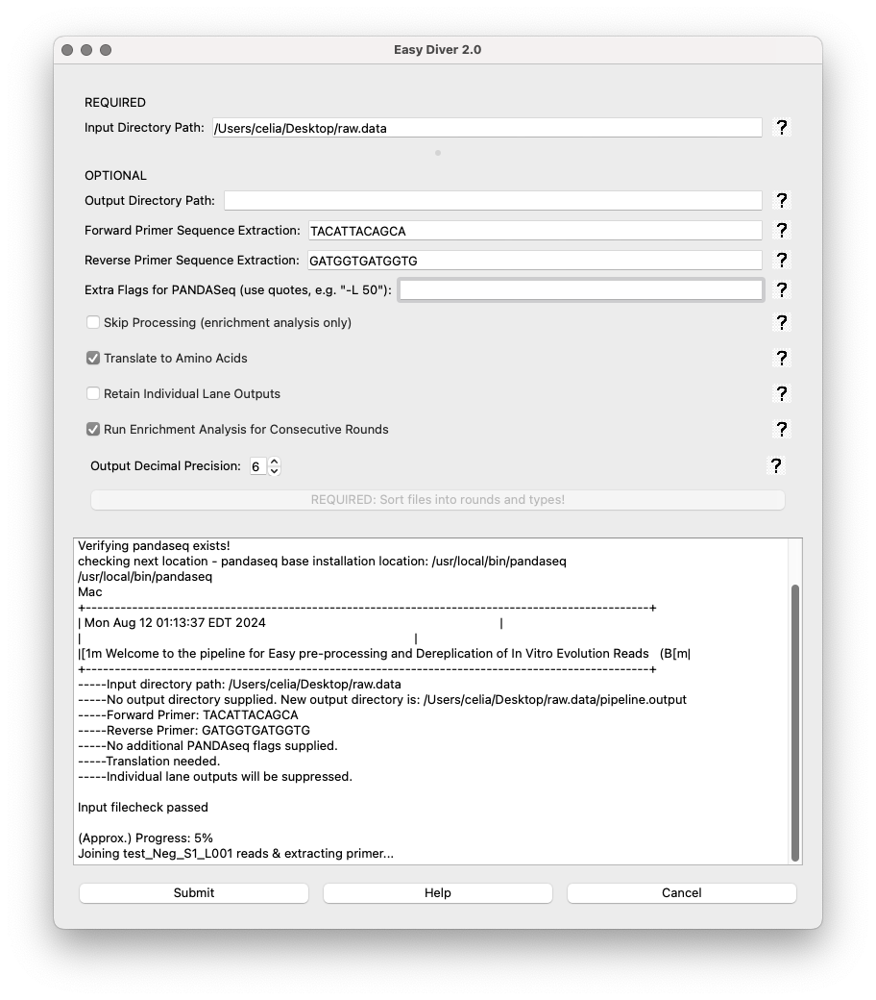
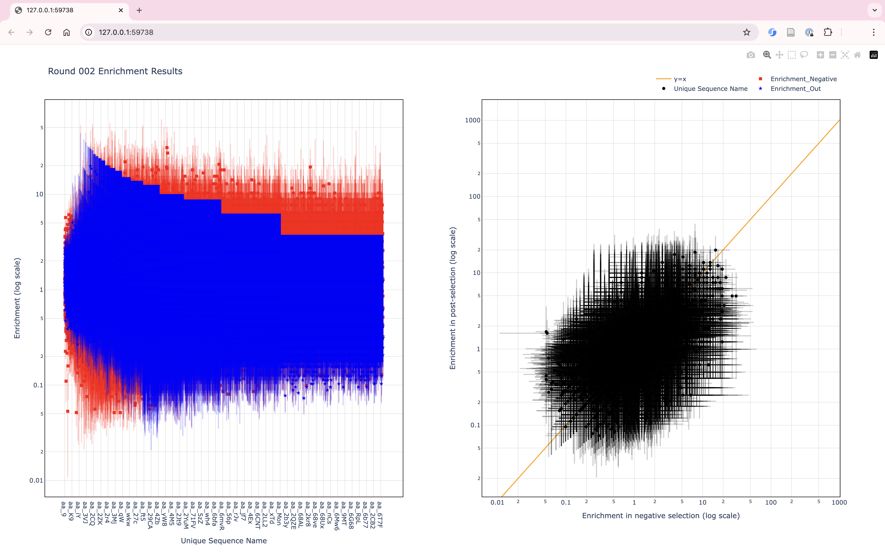
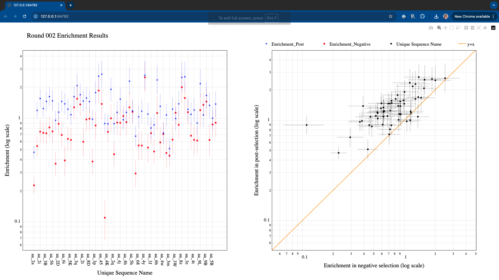

Example: test dataset
=====================

Here, we will run both EasyDIVER 2.0 and the graph generator for the test data provided in the GitHub repository (ADD LINK).

Processing and analyzing the test dataset
-----------------------------------------

First, we downloaded the test data and placed it in a directory called ``raw.data``. 
The forward and reverse primers for the test dataset are TACATTACAGCA and GATGGTGATGGTG, respectively. 
The test dataset corresponds to two rounds of an experimental in vitro evolution of mRNA-displayed
peptides (unpublished), so 'Translate to Amino Acids' is selected.  

.. image:: _static/images/ex1.png
   :alt: EasyDIVER 2.0
   :align: center
   :width: 600px

There are 3 samples per round, corresponding to pre-selection, post-selection, and negative control selection. 
Once the number of rounds has been set to 2, the 6 files can be assigned to their corresponding buckets:

After saving choices, the file ``enrichment_analysis_file_sorting_logic.csv`` will be saved in the output directory. 

Upon submitting the job, the text box at the bottom will start printing real-time information from the run. 

Once data processing and analysis is over, the output directory should have seven folders, a log.txt file, and the sorting csv table. 

.. image:: _static/images/ex4.png
   :alt: EasyDIVER 2.0
   :align: center
   :width: 600px

In the ``modified_counts`` folders, there will be one ``round_00X_enrichment_analysis.csv`` file for each round. These files will have all metrics for each sequence in the post-selection sample for each round. 
For details on how the metrics are calculated see [PAPER REF].
There will also be another six csv files, corresponding to the frequency and the enrichment of all sequences traced across all rounds of selection:

.. image:: _static/images/ex4.png
   :alt: EasyDIVER 2.0
   :align: center
   :width: 600px

Running the Graph Builder for the test dataset
----------------------------------------------

To run the Graph Builder with the processed and analyzed test data, the input directory must correspond to the output from EasyDIVER 2.0: 

Since the dataset corresponds to mRNA-displayed peptides, data type is ‘AA’. 
For testing purposes, we will plot the metrics corresponding to the last round of selection (round 2).
The button “Generate Graphs” will start the graph generation process. 
Once completed, an HTML window displaying the plots will open.
If no cutoff values are specified, the Graph Builder will include all data in the files (in this case, the plots will look crammed and frankly, ugly).

There are two ways in which the user can choose to focus on specific areas or data points in the graphs:

1. By selecting specific plotting regions. The graphs interface is interactive, and specific areas of the plots can be selected by dragging the mouse. 
2. By setting more stringent cutoff values. The user can fill the values in the Graph Builder interface as many times as needed, and a new HTML window will open every time “Generate Graphs” is selected.

For example, increasing the Count_out cutoff threshold significantly reduces the number of data points being represented. 

.. note::
   **Display/hide elements**
      Click on the legend elements to display or hide different elements in the graphs.
   **Individual sequence information**
      Hover the mouse over any data point to display information about the corresponding sequence. 
   **Additional options**
      Hover over the top right corner to reveal an array of icons to: download the plots as PNG, zoom, pan, box select, lasso select, zoom in, zoom out, autoscale, and reset axis.