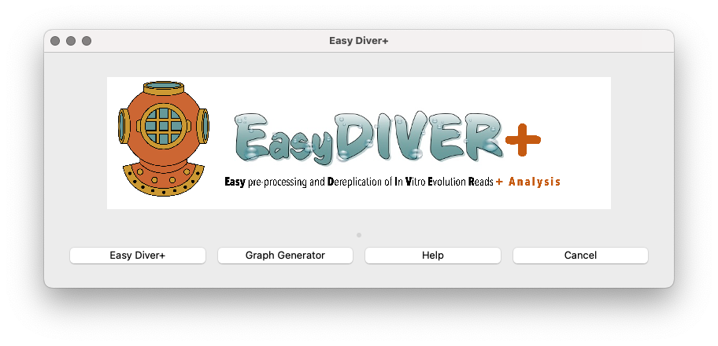
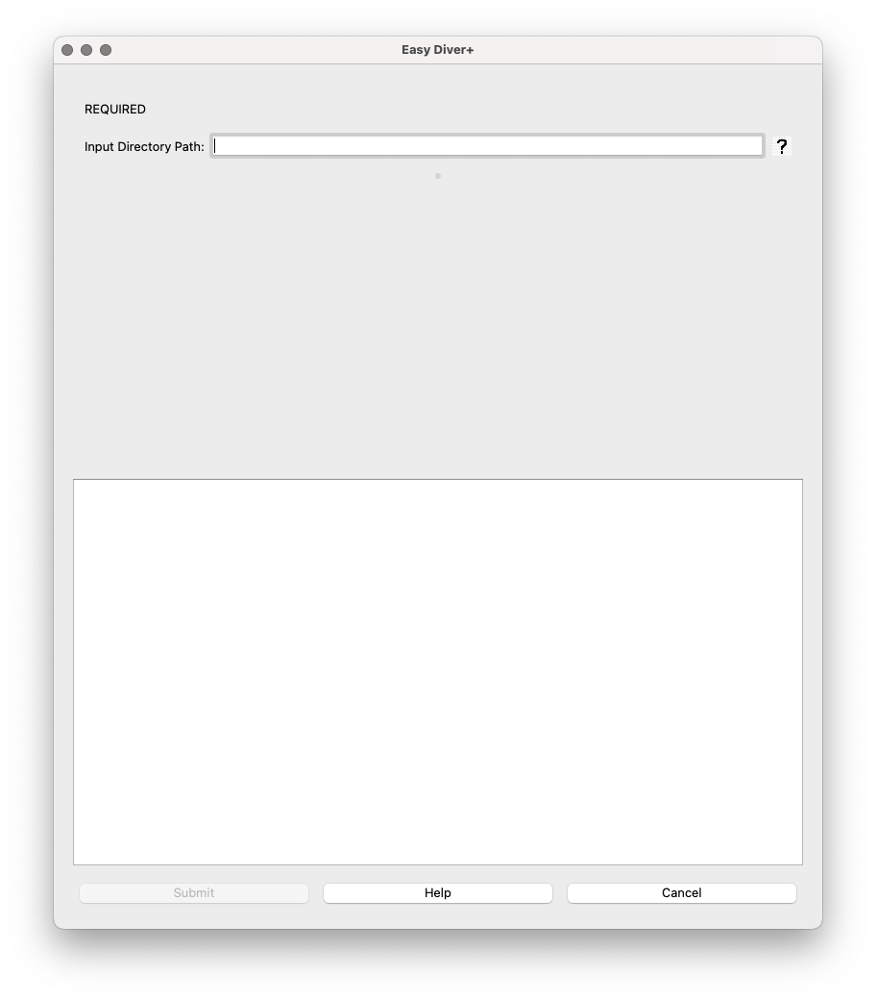
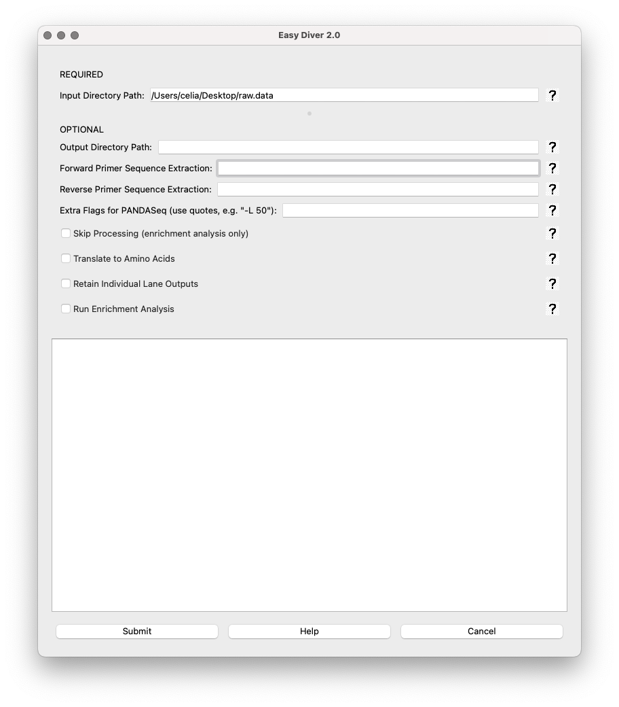
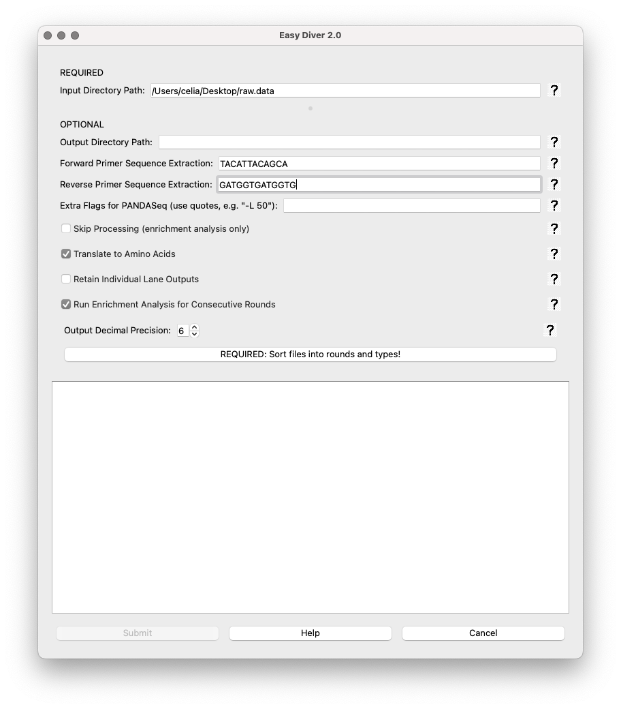
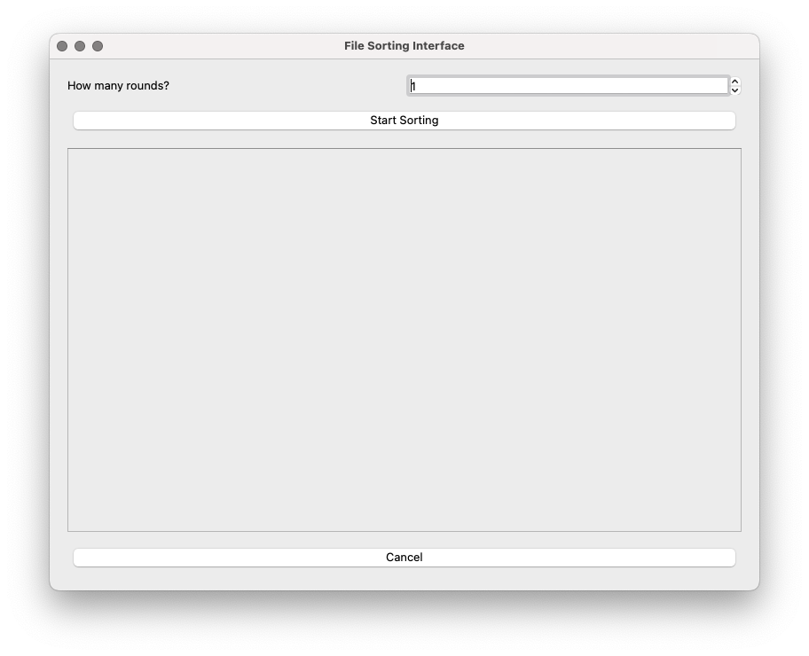
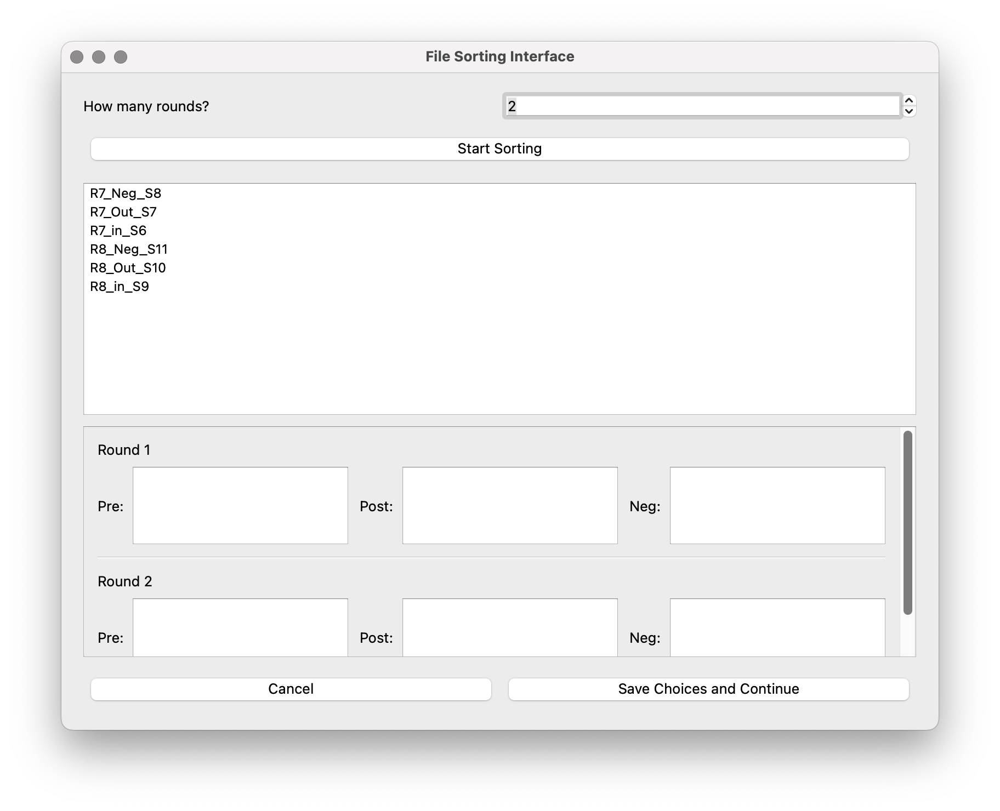
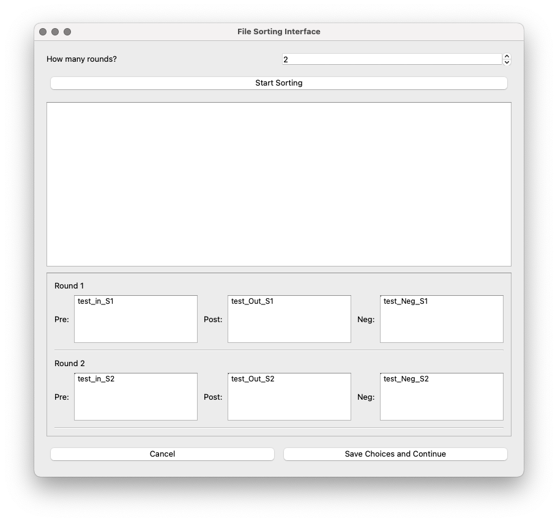
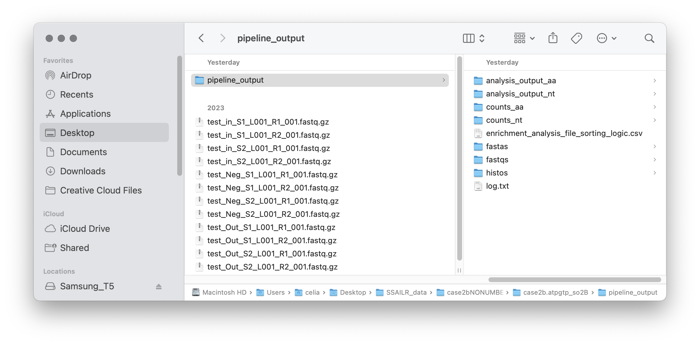
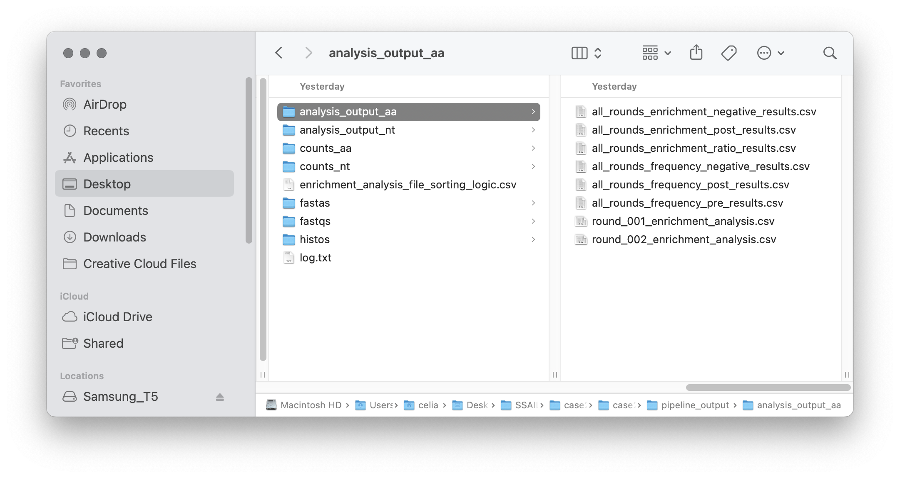
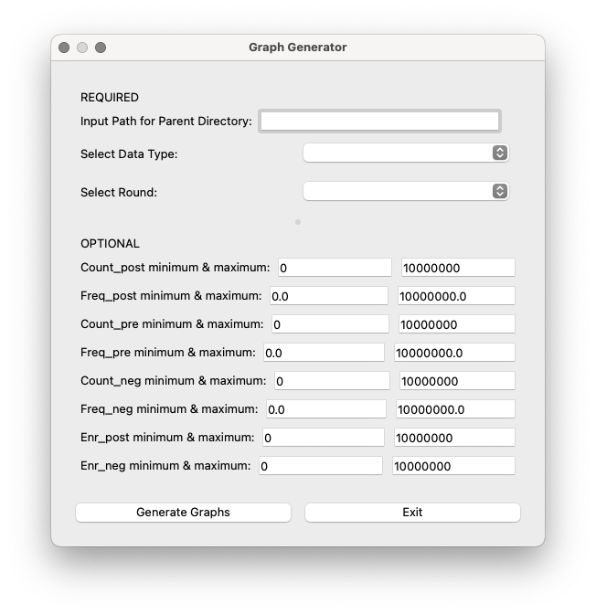

How to use EasyDiver+
=====================

Input requirements
------------------

All input files must be:
    
1. Located in the same directory (even reads from separate lanes).
2. In FASTQ format
3. Named using the standard Illumina naming scheme: sample-name_S#_L00#_R#_001.fastq
4. In either .fastq or .fastq.gz extensions.

How to process and analyze data
-------------------------------

When opening the application, the main interface will appear, featuring options for both EasyDiver+ and the Graph Generator.

Selecting the **EasyDiver+** option will run the EasyDIVER application. 
The only required field is the path to the input directory. 

For illustrative purposes, we will run the interface using the test dataset provided in a `Google Drive directory <https://drive.google.com/drive/folders/102sCv5uJUiUcnsgVskJigmh8lxbl3KCD?usp=sharing>`_.
First, we downloaded the test data and placed it in a directory called ``raw.data`` in the Desktop. 
The forward and reverse primers for the test dataset are TACATTACAGCA and GATGGTGATGGTG, respectively. 
The test dataset corresponds to two rounds of an experimental in vitro evolution of mRNA-displayed
peptides (unpublished), so 'Translate to Amino Acids' is selected.  

* **Input Directory Path**: Field to specify the directory containing raw sequencing files. This field is mandatory.
   

Once the required field is filled, the optional parameters will show up. 

Optional Parameters:

* **Output Directory Path**: Field for specifying where the output files should be saved. If left blank, the default is ``pipeline_output``.
* **Forward Primer Sequence**: Input for the forward primer sequence used in extraction.
* **Reverse Primer Sequence**: Input for the reverse primer sequence used in extraction.
* **Extra Flags for PANDASeq**: Allows additional parameters for PANDASeq to be entered, enclosed in quotes.
* **Skip Processing (enrichment analysis only)**: This option allows running the enrichment analysis without running the processing step first. 
  Use this option only if you have already run the processing step. 
  This option can be especially helpful in the case of many rounds of selection (processing can be run for separate batches of rounds to keep running time manageable, and the analysis can be run using the outputs from the several processing runs). 
* **Translate to Amino Acids**: Checkbox option to translate nucleotide sequences into amino acids.
* **Retain Individual Lane Outputs**: Checkbox to retain output files for each sequencing lane.
* **Run Enrichment Analysis for Consecutive Rounds**: Checkbox to enable enrichment analysis for consecutive rounds of selection/amplification. 

If 'Run Enrichment Analysis for Consecutive Rounds' is selected, two options show up:

* **Output Decimal Precision**: Spin box to set the precision of decimal numbers in the enrichment output files (default is 6, max is 10).
* **Required: Sort Files into Rounds and types!**: A button to open a sorting interface where users can categorize files.

In the sorting interface, the user must first specify how many rounds of selection the experiment has.

* **How many rounds?**: Spin box to set the number of rounds. Default is 1.
* **Start sorting**: A button to open the buckets to assign files from the input directory to each bucket type (Pre-, Post-, Neg-).

The dataset has 6 files, corresponds to an experiment with 2 rounds of selection, 
each of them with pre-selection, post-selection, and a negative control selection. 
Once the number of rounds has been set to 2, and after clicking 'Start sorting', the 6 files in the input directory and the buckets will show up:

The files can be dragged to their corresponding bucket. 

* **Save choices and continue**: A button to save a csv file with the file names and their corresponding type of selection. 

After saving choices, the file ``enrichment_analysis_file_sorting_logic.csv`` will be saved in the output directory. 

.. image:: _static/images/table.png
   :alt: EasyDiver+
   :align: center
   :width: 250px

Once sorting has been completed, the app will return to the parameters interface. 
This interface has three Control Buttons. 
There is also a text box at the bottom of the interface displaying the real-time output of the processing script, including progress and any errors. 
Each field box displays a question mark icon providing additional information.

* **Submit**: Starts the data processing and analysis pipeline with the specified parameters.
* **Help**: Opens a dialog with detailed information about the application.
* **Cancel**: Closes the application.

Upon submitting the job, the text box at the bottom will start printing real-time information from the run. 

.. image:: _static/images/img8.png
   :alt: EasyDiver+
   :align: center
   :width: 600px

Output files
------------

Once data processing and analysis is over, the output directory should have seven folders, a log.txt file, and the sorting csv table. 

The seven folders contain the following:

* **counts_nt**: DNA counts files for every sample (unique sequences, count reads and frequency)
* **counts_aa**: Amino acid counts files for every sample (unique sequences, count reads and frequency)
* **fastas**: Joined fasta files
* **fastqs**: Joined fastq files
* **histos**: DNA sequence length distributions and the peptide sequence length distribution (if translation is required)
* **log.txt**: Log file with information on the parameters used and the outcome of each processing step
* **analysis_output_nt**: DNA enrichment analysis output files (one per round), and frequency and enrichment output files with metric for all sequences across all rounds
* **analysis_output_aa**: Amino acid enrichment analysis output files (one per round), and frequency and enrichment output files with metric for all sequences across all rounds
* **individual.lanes**: all processing files (joined fasta files, joined fastq files, text counts files and text 
  histograms) corresponding to the individual lanes (if requested using the flag -r)

.. note::
   We will focus on the analysis output files here. 
   Please refer to the original EasyDIVER materials (publication and repository)   for a more detailed description of the processing output files. 

In the ``analysis_output`` folders, there will be several ``.csv`` files:

There will be one ``round_00X_enrichment_analysis.csv`` file for each round. 
These files will have 29 columns with all metrics for each sequence found in the post-selection sample of each round. 
For details on how the metrics are calculated see [link to article TBD]:

* **Unique_Sequence_Name**: Unique name (in Base58) for each unique sequence in the entire selection campaign. 
* **Sequence**: DNA or AA sequence.
* **Count_pre**: Count reads in the pre-selection. 
* **Count_Lower_pre**: Lower interval of the 95% confidence interval for the count reads in the pre-selection.
* **Count_Upper_pre**: Upper interval of the 95% confidence interval for the count reads in the pre-selection.
* **Freq_pre**: Relative abundance in the pre-selection (calcualted as count reads divided by total in the pre-selection). 
* **Freq_Lower_pre**: Lower interval of the 95% confidence interval for the relative abundance in the pre-selection.
* **Freq_Upper_pre**: Upper interval of the 95% confidence interval for the relative abundance in the pre-selection.
* **Count_post**: Count reads in the post-selection. 
* **Count_Lower_post**: Lower interval of the 95% confidence interval for the count reads in the post-selection.
* **Count_Upper_post**: Upper interval of the 95% confidence interval for the count reads in the post-selection.
* **Freq_post**: Relative abundance in the post-selection (calcualted as count reads divided by total in the post-selection). 
* **Freq_Lower_post**: Lower interval of the 95% confidence interval for the relative abundance in the post-selection.
* **Freq_Upper_post**: Upper interval of the 95% confidence interval for the relative abundance in the post-selection.
* **Count_neg**: Count reads in the negative control selection. 
* **Count_Lower_neg**: Lower interval of the 95% confidence interval for the count reads in the negative control selection.
* **Count_Upper_neg**: Upper interval of the 95% confidence interval for the count reads in the negative control selection.
* **Freq_neg**: Relative abundance in the negative control selection (calcualted as count reads divided by total in the negative control selection). 
* **Freq_Lower_neg**: Lower interval of the 95% confidence interval for the relative abundance in the negative control selection.
* **Freq_Upper_neg**: Upper interval of the 95% confidence interval for the relative abundance in the negative control selection.
* **Enr_post**: Enrichemnt in the post-selection (calculated as Freq_post divided by Freq_pre)
* **Enr_post_lower**: Lower interval of the 95% confidence interval for the enrichemnt in the post-selection.
* **Enr_post_upper**: Upper interval of the 95% confidence interval for the enrichemnt in the post-selection.
* **Enr_neg**: Enrichemnt in the negative control selection (calculated as Freq_neg divided by Freq_pre)
* **Enr_neg_lower**: Lower interval of the 95% confidence interval for the enrichemnt in the negative control selection.
* **Enr_neg_upper**: Upper interval of the 95% confidence interval for the enrichemnt in the negative control selection.
* **Enr_ratio**: Relative enrichment (calculated as Enr_post divided by Enr_neg)
* **Enr_ratio_lower**: Lower interval of the 95% confidence interval for the relative enrichemnt.
* **Enr_ratio_upper**: Upper interval of the 95% confidence interval for the relative enrichemnt.

If every sample has a negative control, there will be another six csv files, corresponding to the frequency and enrichment of all sequences traced across all rounds of selection.
If there is no negative control, there will only be two files:

* **all_rounds_enrichment_negative_results.csv**: Enrichment in the negative control selection for each unique sequence across all rounds of selection.
* **all_rounds_enrichment_post_results.csv**: Enrichment in the post-selection for each unique sequence across all rounds of selection.
* **all_rounds_enrichment_ratio_results.csv**: Relative enrichment for each unique sequence across all rounds of selection.
* **all_rounds_frequency_negative_results.csv**: Relative frequency in the negative control selection for each unique sequence across all rounds of selection.
* **all_rounds_frequency_post_results.csv**: Relative frequency in the post-selection for each unique sequence across all rounds of selection.
* **all_rounds_frequency_pre_results.csv**: Relative frequency in the pre-selection for each unique sequence across all rounds of selection.

How to run the Graph Generator
----------------------------

The Graph Generator builds graphs using the numerical output from the analysis part, and can only be used if the data has already been processed and analyzed. 
If the Graph Generator option is selected, the main interface will appear: 

* **Input Directory Selection**: This field only shows up if the processing has not been run right before 
  (if processing has been run before, the interface will use the processing output directory as input here)
  Field to specify the directory containing the analysis_output folder. 
  If you run the processing steps at a different time, this field should be filled with the Output Directory Path from processing. 
  If you did not specify an output directory name when running the processing steps, this will be output default name ``pipeline_output``.

* **Select Data Type**: Dropdown menu to choose between ‘DNA’ and ‘AA’. 
  This determines which analysis_output folder is used (analysis_output or analysis_output_aa).

* **Select Round**: Dropdown menu with the available rounds based on the selected directory.
  Choose the desired round for which you want to generate graphs.

Users can customize various cutoff cuttofs for the graphs by entering the desired values in these fields:

* **Count_post minimum & maximum**: Minimum and maximum count reads in the post-selection. 
* **Freq_post minimum & maximum**: Minimum and maximum relative frequency in the post-selection.
* **Count_in minimum & maximum**: Minimum and maximum count reads in the pre-selection.
* **Freq_in minimum & maximum**: Minimum and maximum relative frequency in the pre-selection.
* **Count_neg minimum & maximum**: Minimum and maximum count reads in the negative selection.
* **Freq_neg minimum & maximum**: Minimum and maximum relative frequency in the negative selection.
* **Enr_post minimum & maximum**: Minimum and maximum relative enrichment in the post-selection.
* **Enr_neg minimum & maximum**: Minimum and maximum relative enrichment in the negative selection.

The application will use the provided input parameters and the selected round to generate graphs.
If the graphs are generated successfully, a confirmation message will appear.

Test dataset corresponds to mRNA-displayed peptides, so data type is set as ‘AA’. 
For testing purposes, we will plot the metrics corresponding to the last round of selection (round 2).
The button **Generate Graphs** will start the graph generation process. 
Once completed, an HTML window displaying the plots will open.
If no cutoff values are specified, the Graph Generator will include all data in the files (in this case, the plots will look crammed and probably, very ugly).
If the HTML window is taking too long to open or it's not loading the contents approperly, try adding some cutoff values to reduce the number of points. 

.. image:: _static/images/plot1.png
   :alt: EasyDiver+
   :align: center
   :width: 800px

There are two ways in which the user can choose to focus on specific areas or data points in the graphs:

1. By selecting specific plotting regions. The graphs interface is interactive, and specific areas of the plots can be selected by dragging the mouse. 
2. By setting more stringent cutoff values. The user can fill the values in the Graph Generator interface as many times as needed, and a new HTML window will open every time **Generate Graphs** is selected.

For example, increasing the Count_out cutoff threshold significantly reduces the number of data points being represented. 
In this case, the minimum post-selection count is arbitrarely set to 200 and the maximum frequency in the negative selection to 0.05.

.. image:: _static/images/plot2.png
   :alt: EasyDiver+
   :align: center
   :width: 800px

.. note::
   **Display/hide elements**
      Click on the legend elements to display or hide different elements in the graphs.
   **Individual sequence information**
      Hover the mouse over any data point to display information about the corresponding sequence. 
   **Additional options**
      Hover over the top right corner to reveal an array of icons to: download the plots as PNG, zoom, pan, box select, lasso select, zoom in, zoom out, autoscale, and reset axis.