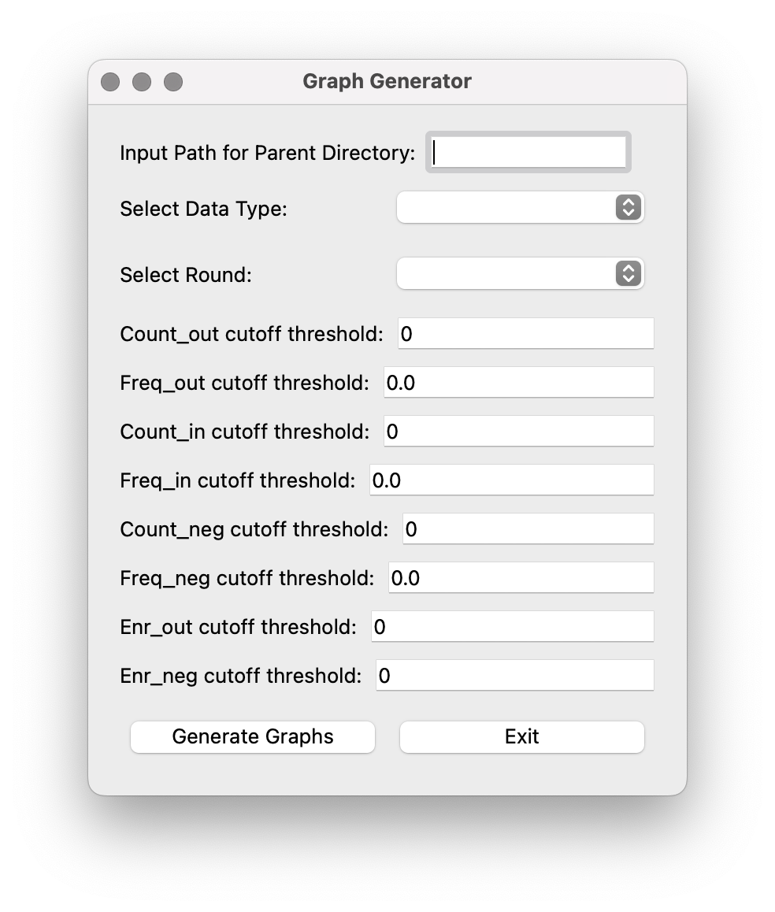

Usage
============================

When opening the application, the main interface will appear, featuring options for both EasyDIVER 2.0 and the Graph Builder.

.. image:: _static/images/img1.png
   :alt: EasyDIVER Logo
   :align: center

EasyDIVER 2.0
----------------------------

Selecting the “EasyDIVER 2.0” option will run the EasyDIVER application. The only required field is the path to the input directory. Once the required field is filled, the optional parameters will show up. 

* **Input Directory Path**: Field to specify the directory containing raw sequencing files. This field is mandatory.
   
.. image:: _static/images/img2.png
   :alt: EasyDIVER 2.0
   :align: center

Optional Parameters:

* **Output Directory Path**: Field for specifying where the output files should be saved. If left blank, the default is ``pipeline.output``.
* **Forward Primer Sequence**: Input for the forward primer sequence used in extraction.
* **Reverse Primer Sequence**: Input for the reverse primer sequence used in extraction.
* **Extra Flags for PANDASeq**: Allows additional parameters for PANDASeq to be entered, enclosed in quotes.
* **Skip Processing (enrichment analysis only)**: This options allows to run the enrichment analysis wihtout running the processing step first. 
  Use this option only if you have already run the processing step. 
  This option can be specially helpful in the case of many rounds of selection (processing can be run for separate batches of rounds to keep running time manageable, and the analysis can be run using the outputs from the several processing runs). 
* **Translate to Amino Acids**: Checkbox option to translate nucleotide sequences into amino acids.
* **Retain Individual Lane Outputs**: Checkbox to retain output files for each sequencing lane.
* **Run Enrichment Analysis**: Checkbox to enable enrichment analysis for consecutive rounds of selection/amplification. 

.. image:: _static/images/img3.png
   :alt: EasyDIVER 2.0
   :align: center

If Run Enrichment Analysis is selected, two options show up:

* **Output Decimal Precision**: Spin box to set the precision of decimal numbers in the enrichment output files (default is 6, max is 10).
* **Required: Sort Files into Rounds and Types**: A button to open a sorting interface where users can categorize files.

.. image:: _static/images/img4.png
   :alt: EasyDIVER 2.0
   :align: center

In the sorting interface, the user must first specify how many rounds of selection the experiment has:

* **How many rounds?**: Spin box to set the number of rounds. Default is 1.
* **Start sorting**: A button to open the buckets to assign files from the input directory to each bucket type (Pre-, Post-, Neg-).

.. image:: _static/images/img5.png
   :alt: EasyDIVER 2.0
   :align: center

Once a number of rounds has been selected, and after clicking 'Start sorting', the files in the input directory and the buckets will show up:

.. image:: _static/images/img6.png
   :alt: EasyDIVER 2.0
   :align: center

The files can be dragged to their corresponding bucket. 

* **Save choices and continue**: A button to save a csv file with the file names and their corresponding type of selection. 

.. image:: _static/images/img7.png
   :alt: EasyDIVER 2.0
   :align: center

Once sorting has been completed, the app will return to the parameters interface. 
This interface has three Control Buttons. 
There is also a text box at the bottom of the interface displaying the real-time output of the processing script, including progress and any errors. 
Each field box displays a question mark icon providing additional information.

* **Submit**: Starts the data processing and analysis pipeline with the specified parameters.
* **Help**: Opens a dialog with detailed information about the application.
* **Cancel**: Closes the application.

Upon submitting a job, the text box in the bottom will start printing real-time information from the run. 

Graph Builder
----------------------------

The Graph Builder can only be use if the data has been processed and analyzed, as the graphs are built using the output from the analyssy part. 
If the Graph Builder option is selected, the main interface will appear: 

* **Input Directory Selection**: Field to specify the directory containing the modified_counts folder. 
  This filed only shows up if EasyDIVER 2.0 has not been run right before.
  If you run EasyDIVER 2.0 at a different time, this field should be filled with the Output Directory Path from EasyDIVER 2.0. 
  If you did not specified an output directory name when running EasyDIVER, this will be ``pipeline.output``

* **Select Data Type**: dropdown menu to choose between ‘DNA’ and ‘AA’. 
  This determines which modified_counts folder is used (modified_counts or modified_counts_aa).

* **Select Round**: dropdown menu with the available rounds based on the selected directory.
  Choose the desired round for which you want to generate graphs.

User can customize various cutoff thresholds for the graphs entering the desired values in these fields:

* **Count_out cutoff threshold**: Minimum count reads in the post-selection. 
* **Freq_out cutoff threshold**: Minimum relative frequency in the post-selection.
* **Count_in cutoff threshold**: Minimum count reads in the pre-selection.
* **Freq_in cutoff threshold**: Minimum relative frequency in the pre-selection.
* **Count_neg cutoff threshold**: Minimum count reads in the negative selection.
* **Freq_neg cutoff threshold**: Minimum relative frequency in the negative selection.
* **Enr_out cutoff threshold**: Minimum relative enrichment in the post-selection.
* **Enr_neg cutoff threshold**: Minimum relative enrichment in the negative selection.

The button “Generate Graphs” will start the graph generation process.
The application will use the provided input parameters and the selected round to generate graphs.
If the graphs are generated successfully, a confirmation message will appear.

Click the “Exit” button to close the application.

